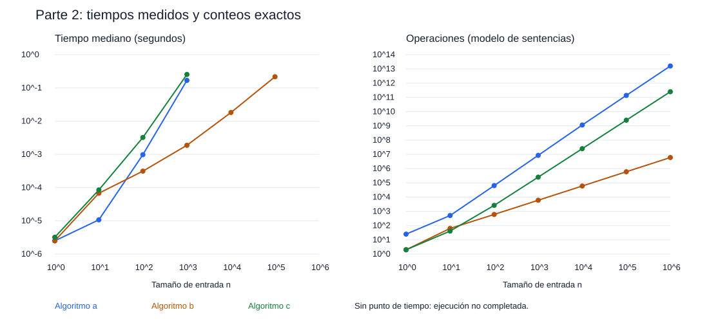

# Resultados de la parte 2

Mediana de 3 ejecuciones completas. Salida de print dirigida a os.devnull.
Un límite alcanzado NO representa un tiempo total medido. El conteo es analítico exacto.

| Algoritmo | n | Tiempo mediano (s) | Operaciones | Operación básica | Estado |
|---|---:|---:|---:|---:|---|
| a | 1 | 0.000002500 | 25 | 2 | completo |
| a | 10 | 0.000010700 | 507 | 120 | completo |
| a | 100 | 0.000977100 | 63957 | 17850 | completo |
| a | 1000 | 0.168298100 | 8519007 | 2505000 | completo |
| a | 10000 | No completado (límite 2 s) | 1150250007 | 350070000 | limite de tiempo |
| a | 100000 | No completado (límite 2 s) | 137502950007 | 42500850000 | limite de tiempo |
| a | 1000000 | No completado (límite 2 s) | 16000034000007 | 5000010000000 | limite de tiempo |
| b | 1 | 0.000002500 | 2 | 0 | completo |
| b | 10 | 0.000067500 | 63 | 10 | completo |
| b | 100 | 0.000312500 | 603 | 100 | completo |
| b | 1000 | 0.001877700 | 6003 | 1000 | completo |
| b | 10000 | 0.018175600 | 60003 | 10000 | completo |
| b | 100000 | 0.216644700 | 600003 | 100000 | completo |
| b | 1000000 | No completado (límite 2 s) | 6000003 | 1000000 | limite de tiempo |
| c | 1 | 0.000003200 | 2 | 0 | completo |
| c | 10 | 0.000084900 | 41 | 9 | completo |
| c | 100 | 0.003224800 | 2609 | 825 | completo |
| c | 1000 | 0.254120900 | 251084 | 83250 | completo |
| c | 10000 | No completado (límite 2 s) | 25010834 | 8332500 | limite de tiempo |
| c | 100000 | No completado (límite 2 s) | 2500108334 | 833325000 | limite de tiempo |
| c | 1000000 | No completado (límite 2 s) | 250001083334 | 83333250000 | limite de tiempo |

Los paneles usan escalas logarítmicas. Segundos y operaciones tienen unidades diferentes.
Los tiempos pequeños son sensibles al ruido del sistema; no prueban por sí solos la complejidad.
